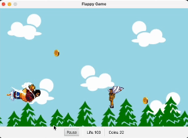

# 👻 Flappy Luffy

A **JavaFX RPG twist** on Flappy Bird:  
Instead of being the hero, you play as the **enemy**, collecting coins while avoiding or defeating heroes that stand in your way.

<p align="center">
  
</p>

---

## 🎮 Features & Mechanics

- **Movement**:
    - Automatic right movement
    - Jump with **Spacebar**

- **Objective**:
    - Collect coins to increase score
    - Avoid or eliminate heroes

- **Difficulty Scaling**:
    - Enemy speed starts at **120 px/s**
    - Speed increases with every coin collected
    - Gravity and jump physics applied

- **Shooting**:
    - Unlimited bullets
    - Press **E** to shoot
    - **1s cooldown** between shots

---

## 🦸 Heroes

- **Melee** ⚔️: Instant death on contact; **+5 coins** if defeated.
- **Stealth** 🕵️: Lose **10 coins** on contact; **+8 coins** if defeated.
- **Tank** 🛡️: Halves health on contact; **+7 coins** if defeated.

---

## 🪙 Coins

- Appear randomly throughout gameplay
- Increase score when collected

---

## 🖥️ UI & Background

- Scrolling background, centered on the enemy
- HUD displays: **score** + **health %**
- Includes a **pause button**

---

## ⌨️ Controls

| Action        | Key      |
|---------------|----------|
| Jump          | W        |
| Shoot         | E        |
| Pause         | Spacebar |

---

## 🚀 Getting Started

### Prerequisites
- Java **17+**
- JavaFX SDK (preferably 21+) installed and added to classpath

### Run the Game

Please use either IntelliJ or Eclipse. The game hasn't been tested on a non-dedicated Java IDE 
Please add the following to your VM options inside your run configuration before running the app:
```
--module-path /path/to/javafx/lib --add-modules javafx.controls,javafx.fxml
```
